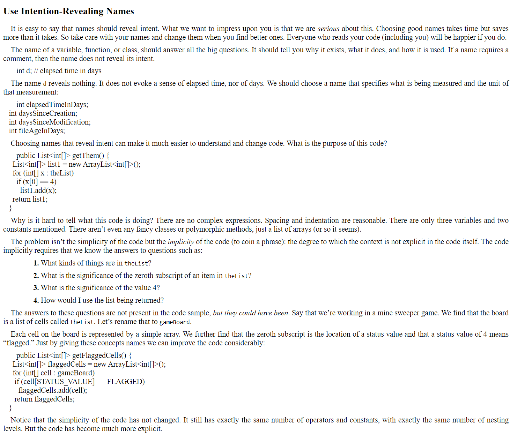
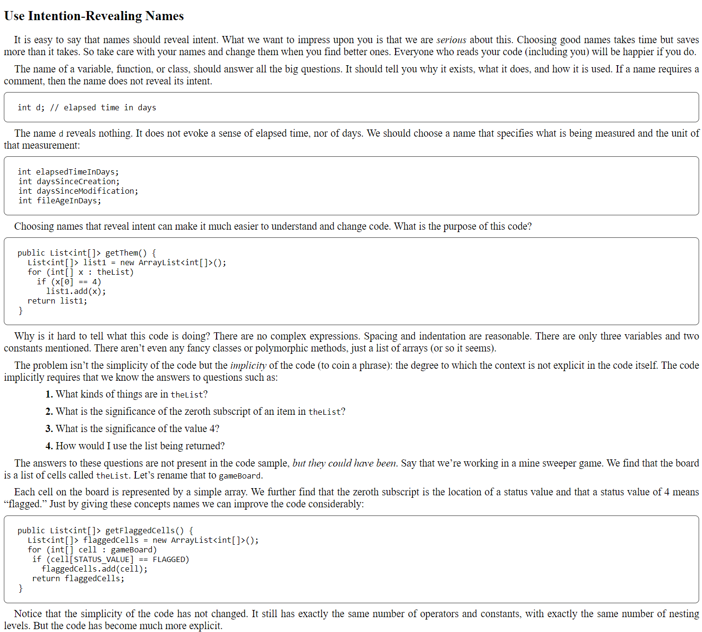

# epub-code-snippets

Simple script to detect code snippets in EPUB html files and improve its formatting.
- Place `html` files at `source` directory
- Update script regexp list (depends on the book and source)
- Run script. It will place updated files into `target` directory

### Example

Before:

After:
